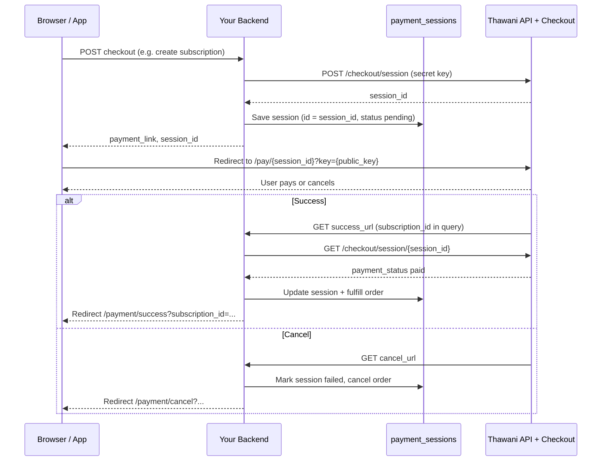

# Thawani Payment Gateway Integration Guide

Portable documentation extracted from **MaksabMeals**. Use this to integrate [Thawani](https://thawani.om) checkout in another Laravel (or any backend) project.

---

## Table of contents

1. [Overview](#overview)
2. [Credentials and environment](#credentials-and-environment)
3. [API base URLs](#api-base-urls)
4. [End-to-end payment flow](#end-to-end-payment-flow)
5. [Thawani API reference (as implemented)](#thawani-api-reference-as-implemented)
6. [Amount and product rules](#amount-and-product-rules)
7. [Configuration in this project](#configuration-in-this-project)
8. [Core classes and files](#core-classes-and-files)
9. [Database schema](#database-schema)
10. [HTTP routes and callbacks](#http-routes-and-callbacks)
11. [Frontend integration](#frontend-integration)
12. [Reusing in a new project](#reusing-in-a-new-project)
13. [Testing and debugging](#testing-and-debugging)
14. [Common errors and fixes](#common-errors-and-fixes)

---

## Overview

Thawani provides a hosted checkout page. Your backend:

1. Creates a **checkout session** via Thawani REST API (server-side, with secret key).
2. Redirects the customer to Thawani’s **payment URL** (includes public key in query string).
3. After payment, Thawani redirects to your **success_url** or **cancel_url**.
4. Your backend **verifies** payment by calling `GET /checkout/session/{session_id}` before fulfilling the order.

This project wraps Thawani in a gateway pattern (`PaymentGatewayInterface` → `ThawaniGateway` → `PaymentService`) and stores sessions in `payment_sessions`.

**Currency:** Omani Rial (OMR). Amounts sent to Thawani are in **baisa** (1 OMR = 1000 baisa).

---

## Credentials and environment

Obtain keys from the Thawani merchant dashboard (UAT for testing, live for production).

| Variable | Purpose |
|----------|---------|
| `THAWANI_PUBLIC_KEY` | Appended to customer payment URL (`?key=...`) |
| `THAWANI_SECRET_KEY` | Sent as `thawani-api-key` header on server API calls |
| `THAWANI_MODE` | `test` → UAT hosts; `live` → production hosts |
| `DEFAULT_PAYMENT_GATEWAY` | Optional; default in this app is `thawani` |
| `APP_URL` | Must be correct — success/cancel URLs are **absolute** routes |

Example `.env`:

```env
APP_URL=https://your-domain.com

THAWANI_PUBLIC_KEY=your_public_key
THAWANI_SECRET_KEY=your_secret_key
THAWANI_MODE=test

DEFAULT_PAYMENT_GATEWAY=thawani
```

**Required config shape** (used by `ThawaniGateway`):

```php
[
    'public_key' => '...',
    'secret_key' => '...',
    'mode' => 'test', // or 'live'
]
```

> **Note:** If you store gateway config in the database (`payment_gateways` table), use `public_key` and `secret_key` — not `api_key` / `secret`. The seeder sample in this repo uses placeholder keys; production should match `.env` or admin-updated JSON.

---

## API base URLs

| Environment | API base (server calls) | Checkout page base (browser redirect) |
|-------------|-------------------------|----------------------------------------|
| Test (UAT) | `https://uatcheckout.thawani.om/api/v1` | `https://uatcheckout.thawani.om` |
| Live | `https://checkout.thawani.om/api/v1` | `https://checkout.thawani.om` |

Logic in `ThawaniGateway`:

- `mode === 'live'` → production URLs.
- Any other `mode` (e.g. `test`) → UAT URLs.

---

## End-to-end payment flow



### Steps in plain language

1. **Initiate payment** — Authenticated API creates a pending business record (here: `Subscription`) and calls `PaymentService::createPaymentLink()`.
2. **Create Thawani session** — `ThawaniGateway::createPaymentLink()` POSTs to `/checkout/session`.
3. **Persist session** — Row in `payment_sessions` with primary key = Thawani `session_id`.
4. **Redirect customer** — Frontend sets `window.location.href = payment_link`.
5. **Return from Thawani** — User lands on `GET /api/payments/success?subscription_id={id}` (no auth; public callback).
6. **Validate** — Backend loads latest `PaymentSession` for that subscription, calls `GET /checkout/session/{sessionId}` on Thawani, checks `payment_status === 'paid'`.
7. **Fulfill** — Update subscription, create transaction, etc. (`PaymentController::processSuccessfulPayment`).

Optional: `GET /api/payments/status/{subscriptionId}` polls Thawani if the UI lands on success before validation completes.

---

## Thawani API reference (as implemented)

### Authentication

All server requests:

```http
Content-Type: application/json
Accept: application/json
thawani-api-key: {THAWANI_SECRET_KEY}
```

Implementation: cURL in `ThawaniGateway::makeRequest()`.

### 1. Create checkout session

**Request**

```http
POST {baseUrl}/checkout/session
```

**Body**

```json
{
  "client_reference_id": "thawani_67890abc",
  "mode": "payment",
  "products": [
    {
      "name": "Subscription Payment",
      "quantity": 1,
      "unit_amount": 130000
    }
  ],
  "success_url": "https://your-domain.com/api/payments/success?subscription_id=1",
  "cancel_url": "https://your-domain.com/api/payments/cancel?subscription_id=1",
  "metadata": {
    "model_type": "App\\Models\\Subscription",
    "model_id": 1,
    "user_id": 4
  }
}
```

| Field | Notes |
|-------|--------|
| `client_reference_id` | Unique per session; this app uses `uniqid('thawani_')` |
| `mode` | Always `"payment"` |
| `products[].unit_amount` | Integer **baisa**: `(int)($amountOmr * 1000)` |
| `products[].name` | Max **39** characters (see [formatting](#amount-and-product-rules)) |
| `success_url` / `cancel_url` | Must be **fully qualified HTTPS URLs** |
| `metadata` | Custom; not required by Thawani but useful for your app |

**Success response (expected shape)**

```json
{
  "data": {
    "session_id": "checkout_session_xxx",
    ...
  }
}
```

**Customer payment URL** (built by app, not returned as single field):

```
{checkoutHost}/pay/{session_id}?key={THAWANI_PUBLIC_KEY}
```

Example (UAT):

```
https://uatcheckout.thawani.om/pay/checkout_session_xxx?key=your_public_key
```

### 2. Retrieve / validate session

**Request**

```http
GET {baseUrl}/checkout/session/{session_id}
```

**Status mapping** (`ThawaniGateway::validatePayment`)

| Thawani `payment_status` | App status | `isValid` |
|--------------------------|------------|-----------|
| `paid` | `paid` | `true` |
| `pending` | `pending` | `false` |
| `failed` | `failed` | `false` |
| other | `failed` | `false` |

---

## Amount and product rules

### OMR → baisa

```php
$unitAmountBaisa = (int)($amountInOmr * 1000);
```

Examples:

| OMR | Baisa (`unit_amount`) |
|-----|------------------------|
| 1.00 | 1000 |
| 130.00 | 130000 |
| 0.500 | 500 |

Do **not** multiply by 100 (that would be fils-style rounding for some currencies; Thawani here uses **1000 baisa per OMR**).

### Product name length

Thawani limits product name length. This app truncates to 39 characters:

```php
// If longer than 39 chars: '...' + first (39 - 3) characters (multibyte-safe)
private function formatProductName(string $name): string
```

Use short descriptions or the same helper in your new project.

---

## Configuration in this project

**File:** `config/payment.php`

```php
'default_gateway' => env('DEFAULT_PAYMENT_GATEWAY', 'thawani'),

'gateways' => [
    'thawani' => [
        'public_key' => env('THAWANI_PUBLIC_KEY'),
        'secret_key' => env('THAWANI_SECRET_KEY'),
        'mode' => env('THAWANI_MODE', 'test'),
    ],
],
```

**Loading order** (`PaymentService`):

1. Active rows from `payment_gateways` table (if present and valid).
2. Fallback to `config/payment.php` if DB empty or unavailable.

**Active gateway:** `config('payment.default_gateway')` if that gateway loaded; else first available.

**Force Thawani:** Cart checkout calls `$paymentService->switchGateway('thawani')` before creating the link.

**Callback URLs** (auto-generated, absolute):

```php
'success_url' => route('payment.success', ['subscription_id' => $data['model_id']], true),
'cancel_url'  => route('payment.cancel', ['subscription_id' => $data['model_id']], true),
```

Ensure `APP_URL` matches your public API host (e.g. `https://api.example.com` if routes are under `/api`).

---

## Core classes and files

| File | Role |
|------|------|
| `app/Services/PaymentGateways/ThawaniGateway.php` | Thawani HTTP client: create session, validate session |
| `app/Services/PaymentService.php` | Gateway registry, `createPaymentLink`, `validatePayment`, DB session |
| `app/Contracts/PaymentGatewayInterface.php` | `createPaymentLink`, `validatePayment` |
| `app/DTOs/PaymentLinkResponse.php` | `paymentLink`, `sessionId`, `gatewayData`, `gatewayName` |
| `app/DTOs/PaymentValidationResponse.php` | `isValid`, `status`, `gatewayData`, `errorMessage` |
| `app/Http/Controllers/Api/PaymentController.php` | Success/cancel/webhook/status handlers |
| `app/Http/Controllers/Api/SubscriptionController.php` | Creates subscription + payment link |
| `app/Models/PaymentSession.php` | Local session record (string PK = Thawani session id) |
| `config/payment.php` | Env-based gateway config |
| `debug_thawani_api.php` | CLI script to test link creation |

### `createPaymentLink` input (PaymentService)

Your controller should pass:

```php
[
    'user_id' => $userId,
    'model_type' => Subscription::class,  // or any order model
    'model_id' => $orderId,
    'amount' => 130.00,                   // OMR decimal
    'currency' => 'OMR',
    'description' => 'Order description', // → product name
    'subscription_data' => [],            // optional; stored in gateway_data JSON
]
```

**Response** (`PaymentLinkResponse`):

```php
$response->paymentLink;  // Full URL for browser redirect
$response->sessionId;    // Thawani session id
$response->gatewayName; // 'thawani'
```

---

## Database schema

**Table:** `payment_sessions`

| Column | Type | Description |
|--------|------|-------------|
| `id` | string (PK) | Thawani `session_id` |
| `user_id` | FK | Customer |
| `model_type` / `model_id` | morph | Linked order/subscription |
| `gateway_name` | string | e.g. `thawani` |
| `amount` | decimal | OMR |
| `currency` | string | `OMR` |
| `status` | enum | `pending`, `paid`, `failed`, `expired` |
| `payment_link` | text | Hosted checkout URL |
| `gateway_data` | json | Thawani response + app extras (`subscription_data`) |
| `expires_at` | timestamp | Default +24 hours in `PaymentService` |
| `paid_at` | timestamp | Set when status becomes `paid` |

**Table:** `payment_transactions` — audit row after successful validation.

**Table:** `payment_gateways` — optional DB-driven config (`name`, `display_name`, `is_active`, `config` JSON).

Migration: `database/migrations/2025_09_01_081945_create_payment_sessions_table.php`

---

## HTTP routes and callbacks

Defined in `routes/api.php` (public, no Sanctum):

| Method | Path | Name | Handler |
|--------|------|------|---------|
| GET | `/api/payments/success` | `payment.success` | Validate + process payment |
| GET | `/api/payments/cancel` | `payment.cancel` | Mark failed, cancel pending subscription |
| POST | `/api/payments/webhook` | `payment.webhook` | Generic webhook (`session_id` in body) |
| GET | `/api/payments/status/{subscriptionId}` | — | Poll session / re-validate with Thawani |

**Success handler behavior**

1. Query param: `subscription_id` (required).
2. Latest non-failed `PaymentSession` for that subscription.
3. `validatePayment(session_id)` against Thawani.
4. On success: `processSuccessfulPayment()` → subscription `active`, `payment_status` `paid`, items, `PaymentTransaction`.
5. Redirect to frontend: `/payment/success?subscription_id={id}&success=1`.

**Cancel handler**

- Marks pending session `failed`, pending subscription `cancelled`.
- Redirect: `/payment/cancel?subscription_id=...`

**Webhook**

- Accepts `session_id`, `payment_intent_id`, or `order_id` in JSON body.
- Re-validates with Thawani; does not replace success URL flow in typical use.

Frontend routes (`resources/js/app.jsx`):

- `/payment/success` — `PaymentSuccess.jsx`
- `/payment/cancel` — cancel page

---

## Frontend integration

After checkout API returns success:

```javascript
if (response.data.success && response.data.payment_link) {
  window.location.href = response.data.payment_link;
}
```

Used in:

- `resources/js/pages/Customer/Cart.jsx` (cart checkout)
- `resources/js/pages/Customer/SubscriptionForm.jsx` (direct subscription)

**Status check** (`resources/js/services/api.js`):

```javascript
paymentsAPI.checkStatus(subscriptionId)
// GET /api/payments/status/{subscriptionId}
```

`PaymentSuccess.jsx` reads `subscription_id` and optional `success=1` from query string; if `success` is missing, it calls `checkStatus`.

---

## Reusing in a new project

### Minimal PHP (no Laravel)

```php
class ThawaniClient
{
    public function __construct(
        private string $publicKey,
        private string $secretKey,
        private bool $live = false,
    ) {}

    private function apiBase(): string
    {
        return $this->live
            ? 'https://checkout.thawani.om/api/v1'
            : 'https://uatcheckout.thawani.om/api/v1';
    }

    private function checkoutBase(): string
    {
        return $this->live
            ? 'https://checkout.thawani.om'
            : 'https://uatcheckout.thawani.om';
    }

    public function createSession(float $amountOmr, string $description, string $successUrl, string $cancelUrl, array $metadata = []): array
    {
        $body = [
            'client_reference_id' => uniqid('thawani_'),
            'mode' => 'payment',
            'products' => [[
                'name' => mb_strlen($description) <= 39 ? $description : '...' . mb_substr($description, 0, 36),
                'quantity' => 1,
                'unit_amount' => (int) round($amountOmr * 1000),
            ]],
            'success_url' => $successUrl,
            'cancel_url' => $cancelUrl,
            'metadata' => $metadata,
        ];

        $response = $this->request('POST', '/checkout/session', $body);
        $sessionId = $response['data']['session_id'];
        return [
            'session_id' => $sessionId,
            'payment_url' => $this->checkoutBase() . '/pay/' . $sessionId . '?key=' . $this->publicKey,
        ];
    }

    public function getSession(string $sessionId): array
    {
        return $this->request('GET', '/checkout/session/' . $sessionId);
    }

    public function isPaid(string $sessionId): bool
    {
        $data = $this->getSession($sessionId);
        return ($data['data']['payment_status'] ?? '') === 'paid';
    }

    private function request(string $method, string $path, ?array $body = null): array
    {
        $ch = curl_init($this->apiBase() . $path);
        curl_setopt_array($ch, [
            CURLOPT_RETURNTRANSFER => true,
            CURLOPT_HTTPHEADER => [
                'Content-Type: application/json',
                'Accept: application/json',
                'thawani-api-key: ' . $this->secretKey,
            ],
        ]);
        if ($method === 'POST') {
            curl_setopt($ch, CURLOPT_POST, true);
            curl_setopt($ch, CURLOPT_POSTFIELDS, json_encode($body));
        }
        $raw = curl_exec($ch);
        $code = curl_getinfo($ch, CURLINFO_HTTP_CODE);
        curl_close($ch);
        if ($code >= 400) {
            throw new RuntimeException("Thawani HTTP $code: $raw");
        }
        return json_decode($raw, true);
    }
}
```

### Checklist for a new Laravel app

1. Copy or reimplement `ThawaniGateway` + `PaymentGatewayInterface` + DTOs.
2. Add `config/payment.php` and `.env` keys.
3. Migrate `payment_sessions` (and optionally `payment_transactions`, `payment_gateways`).
4. Register public routes for **absolute** `success_url` and `cancel_url`.
5. Set `APP_URL` to your public API base.
6. On success callback: always **server-side** `GET /checkout/session/{id}` before marking order paid (never trust redirect alone).
7. Redirect user to your SPA success page with your own order reference id.
8. Store extra order payload in `gateway_data` JSON (as `subscription_data` here) if fulfillment happens after payment.

### What to generalize vs keep app-specific

| Reusable | MaksabMeals-specific |
|----------|----------------------|
| Thawani session create/validate | `Subscription`, `SubscriptionItem` |
| Amount baisa conversion | Meal delivery date calculation |
| Payment URL format | Arabic descriptions in checkout |
| `payment_sessions` pattern | Cart checkout flow |

---

## Testing and debugging

### Script

From project root:

```bash
php debug_thawani_api.php
```

Bootstraps Laravel, calls `PaymentService::createPaymentLink()` with sample data, prints `payment_link` and `session_id`.

### Manual test flow

1. Set UAT keys and `THAWANI_MODE=test`.
2. Create payment link via API or debug script.
3. Open `payment_link` in browser; complete test payment on UAT.
4. Confirm redirect hits `/api/payments/success?subscription_id=...`.
5. Confirm `payment_sessions.status` = `paid` and Thawani dashboard shows session paid.

### Logs

Search Laravel logs for:

- `Thawani API Request`
- `Payment link created`
- `Payment validation completed`
- `Thawani API error: HTTP ...`

---

## Common errors and fixes

| Symptom | Likely cause | Fix |
|---------|----------------|-----|
| HTTP 401/403 from Thawani | Wrong secret key or UAT vs live mismatch | Match keys to `THAWANI_MODE` and host |
| Invalid success/cancel URL | Relative URLs | Use full `https://...` URLs (`route(..., true)` or manual) |
| Wrong charge amount | Used ×100 instead of ×1000 | `unit_amount = (int)(omr * 1000)` |
| Product name rejected | Name too long | Truncate to 39 chars |
| Payment success but order not updated | No `subscription_id` on callback | Pass `model_id` in success route query |
| Session not found on success | Wrong subscription or session already `failed` | Use latest session for that `model_id` |
| Gateway not loaded from DB | Seeder uses `api_key` not `public_key` | Align DB `config` JSON with `validateGatewayConfig` keys |
| cURL SSL errors | Local environment | Verify CA bundle; only disable SSL verify in local dev if unavoidable |

---

## Official documentation

Refer to Thawani’s current merchant/API documentation for fields not covered here (refunds, webhooks if they add signed callbacks, etc.). This document reflects **only what this repository implements** as of the extraction date.

---

## Quick reference card

```
ENV:     THAWANI_PUBLIC_KEY, THAWANI_SECRET_KEY, THAWANI_MODE=test|live
AUTH:    Header thawani-api-key: {secret}
CREATE:  POST /api/v1/checkout/session
PAY URL: {checkoutHost}/pay/{session_id}?key={public_key}
VERIFY:  GET /api/v1/checkout/session/{session_id} → payment_status === 'paid'
AMOUNT:  unit_amount = (int)(OMR * 1000)
NAME:    max 39 chars
URLS:    success_url & cancel_url must be absolute HTTPS
```
